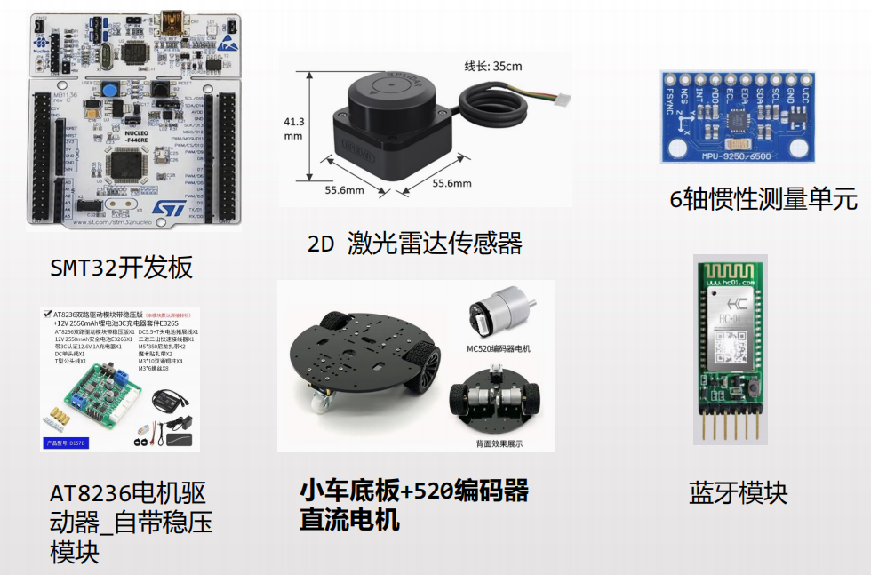
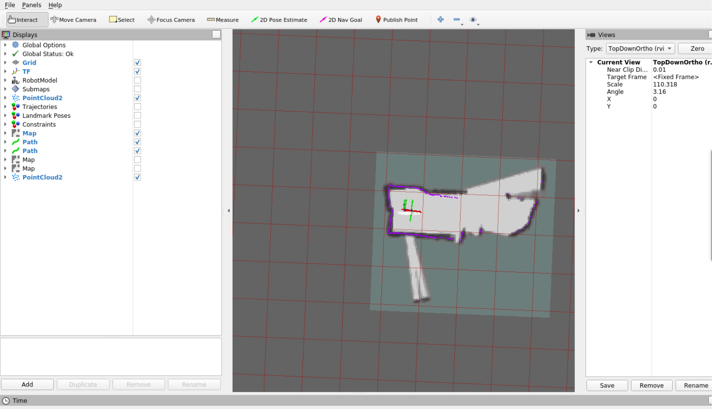

# 面向迷宫环境的自主导航移动机器人

该项目基于北邮国际学院design&build课程，旨在从零打造一台能够自主导航决策并实时建图的移动机器人。该项目涉及嵌入式开发、SLAM、导航等多项具身智能技术栈。

---

## 零、效果演示


---

## 一、 硬件材料清单

微控制器
- STM32F446RE开发板（NUCLEO-F446RE开发板）

传感器
- 2D 激光雷达：SLAMTEC RPLIDAR C1
- 6轴惯性测量单元：MPU6500

执行器
- 编码器直流电机：MC520编码器电机
- 电机驱动板：D157B模块(驱动芯片AT8236)

通信模块
- HC-04蓝牙模块

其他
- 小车底板、杜邦线、电池等



---
## 二、开发环境

### 2.1 嵌入式开发环境

- 本项目使用STM32CubeMX+ Keil5工具链，基于HAL库完成开发，使用VOFA完成串口调试

### 2.2 上位机开发环境

- 上位机操作系统为Windows 11，基于wsl构建docker环境
- Docker容器内使用Ubuntu20.04操作系统，安装ROS Noetic
- Windows系统上使用XLaunch作为X11服务器，负责利用Windows图形化显示资源显示容器内的图形化界面

---

## 三、单片机代码说明

### 3.1 单片机代码主要解决的两个问题
1. 将传感器数据封装上传
2. 接收速度控制指令并执行运动控制

### 3.2 各功能模块说明

传感器模块
- **radar.c/h**：负责单片机与雷达之间的串口通信以及雷达数据帧解析
- **mpu6500.c/h**：负责单片机与MPU6500之间的SPI通信以及位姿解算
- **encoder.c/h**：使用外部中断读取编码器脉冲，并解析速度（T法）

执行器模块
- **pwm.c/h**：负责两个电机的pwm输出
- **pid.c/h**：实现了双轮速度环和偏航角速度环

上位机通信模块
- **frame.c/h**：定义单片机与上位机双向通信的数据帧格式（上行数据：传感器数据；下行数据：速度指令）

任务调度模块
- **main.c**：使用定时器中断完成任务调度

### 3.3 PID调参建议

建议遵循以下PID调参步骤（以速度环为例）：
1. 将所有PID参数（机械零点、Kp、Ki、Kd）归零
2. 使用VOFA示波器打印反馈量（速度）曲线
3. 用手转动电机，观察示波器数值，大致确定速度极大值和正常工作时的一般值
4. 根据经验值确定一个最大误差，为了纠正这个最大误差，需要输出量最大，根据**最大误差对应最大输出量的关系**，大致确定Kp值
5. 将上一步求得的Kp赋值给PID控制器，通过实验观察系统实际响应（通过代码设置一个较高的目标速度值，并让电机转动，用手抓住电机然后松开，观察速度响应），然后微调Kp直至最优。好的Kp应该具备**快速响应、略微超调、低频震荡**的特性。
6. 将电机放在地上转动，观察是否出现静态误差（速度曲线稳定后始终与目标速度有一定误差），若出现则增大Ki，直至静态误差消除
7. 此时系统应该会出现低频震荡的现象，于是从零开始逐渐增大Kd，直至震荡消除
8. 若增大Kd始终无法消除震荡，则适当减小Kp后重新调整Kd

注意：根据电机正反馈/负反馈表现确定参数极性

### 3.4 开发过程的BUG集锦&遗留问题

1. MPU6500一开始采用I2C与单片机通信，但是经过示波器排查，发现I2C很容易受到工作中的电机干扰，于是改用SPI进行通信
2. 一开始采用串口中断的方式实现单片机与上位机的双向通信，但是出现通信卡死的现象，改为使用DMA后问题得到解决
3. 基于低速、高负载情况下控制系统出现非线性的实验现象，PID速度环采用分段式PID、设置死区的控制策略，实现方式不够优雅，后续可考虑采用模糊PID、自抗扰控制等进阶算法作为改进算法
4. 编码器速度曲线毛刺多，可从检查采样代码、改进滤波算法等方面考虑改进

---

## 4. 上位机代码说明

### 4.1 上位机软件架构

#### 4.1.1 Windows端

**serial_container_link.py**：由于在Windows中使用Docker容器，容器内部无法直接访问Windows系统下的串口资源，所以需要在Windows端编写基于TCP通信的数据转发脚本，用于建立Windows串口与容器之间的双向通信桥梁

#### 4.1.2 Docker容器内

**car_slam功能包**：负责下位机驱动和使用cartographer建图
- speed_cmd_ros.py节点：用于接收速度指令话题，并向tcp端口发送速度控制数据帧
- laser_imu_lio_publisher_14.py节点：作为小车驱动节点，解析上行的传感器数据帧，并发布/scan、/imu、/odometry话题
- 其余两个节点为可选调试节点

**car_navigation功能包**：基于navigation框架，集成Dijkstra全局规划器和DWA局部规划器，负责小车的导航功能

### 4.2 上位机复现指南

*以下指南默认读者已经完成上位机开发环境搭建*

1. 在容器内安装cartographer和navigation，此处可参考网络教程，不过多赘述

2. **serial_container_link.py**脚本可直接在windows系统上运行，但需要让电脑与蓝牙模块连接（可参考 *蓝牙模块配置步骤.pdf*）

3. 启动docker容器，创建工作区和软件包：

```bash
cd /home

mkdir -p noetic_ws/src

cd noetic_ws/src

catkin_create_pkg car_slam rospy roscpp std_msgs

catkin_create_pkg car_navigation roscpp rospy tf geometry_msgs move_base_msgs actionlib

cd ..

catkin_make
```

4. 将相应功能包的代码粘贴到对应位置，并给所有python脚本设置可执行权限，最后再次运行catkin_make 编译整个工作空间

5. 在容器内运行`carto_slam_laser_imu.launch`文件：

```bash
roslaunch car_slam carto_slam_laser_imu.launch
```

6. 在容器内运行`car_navigation.launch`文件：

```bash
roslaunch car_navigation car_navigation.launch
```

7. 此时Rviz被启动，可以看到部分建图结果



8. 可通过2D Nav Goal在图中直接指定目标位置，随后机器人可以自行导航到目标点

### 4.3 上位机开发的BUG集锦&遗留问题

1. 在选择SLAM算法时考虑了兼容ROS生态的三个主流算法：hector_mapping、gmapping、cartographer，实际尝试后发现cartographer的性能最好，其他两个算法对于较快速的运动，尤其是旋转运动适应性较差
2. 当前版本代码在导航过程中可能会出现狭小路口难以通过，来回震荡的情况，具体原因尚不明确，可能与规划器调参、代价地图调参、下位机控制精度低等因素有关